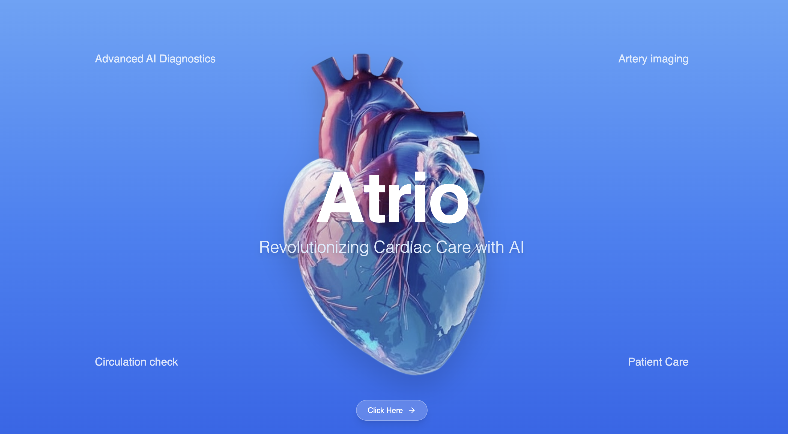
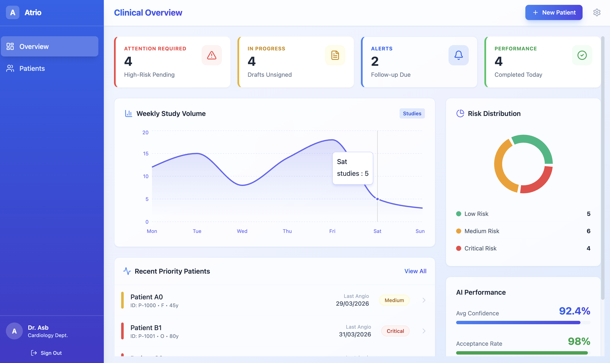
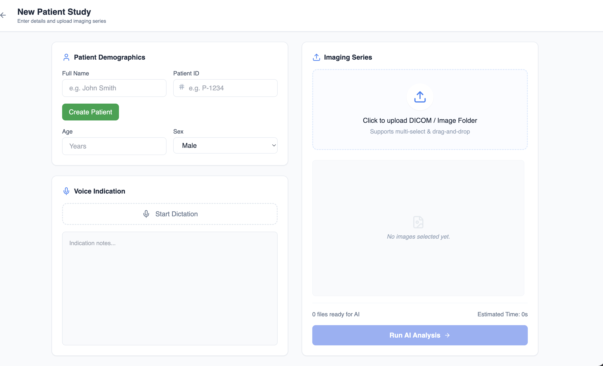
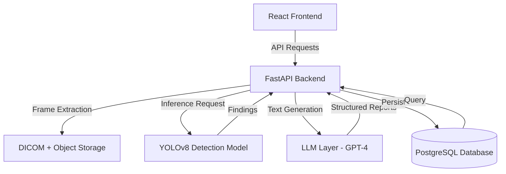

# Atrio

### AI-Assisted Angiography Workflow Platform

Atrio is an AI-assisted clinical workflow platform for cardiologists. It transforms raw DICOM cine images into prioritized findings, visual evidence, and structured reports — while keeping the doctor fully in control. It is not a diagnostic replacement. It is an assistive workflow layer.

---

## The Problem

- Doctors manually scrub through hundreds of cine frames per study
- Identifying stenosis and mapping arteries is slow and cognitively heavy
- Important frames are hard to locate without full manual review
- Report writing and procedure documentation are repetitive and time-consuming
- Clinical context (risk scores, prior studies, notes) is fragmented
- High cognitive load after performing an invasive procedure

This leads to longer turnaround times, increased workload, and potential for missed insights.

---

## The Solution

Atrio builds an intelligent workflow layer on top of angiography reading:

- AI detects stenosis and highlights critical frames automatically
- Doctors jump directly to relevant findings instead of manual scrubbing
- Human-in-the-loop design ensures full clinical control at every step
- Voice and natural language input reduces documentation effort
- Reports and procedure notes are auto-generated and structured

---

## App Screenshots

<p align="center">
  
  <br/>
  <em>Landing page — entry point and platform overview</em>
</p>

<p align="center">
  
  <br/>
  <em>Doctor dashboard — patients, studies, and workflow actions</em>
</p>

<p align="center">
  
  <br/>
  <em>Patient onboarding and study creation flow</em>
</p>

---

## Key Features

### 1. AI-Powered Stenosis Detection

- YOLO-based deep learning model
- Detects suspected blockages in angiography cine frames
- Outputs bounding boxes with confidence scores
- Optional percentage stenosis estimation
- Frame-level prioritization based on detection confidence
- Model weights available at: https://huggingface.co/rachitgoyell/stenosis-detection/

### 2. Findings Inbox and Smart Review

- Google Photos-style infinite scroll through cine frames
- Automatically surfaces and highlights important frames
- Jump-to-Detection functionality for instant navigation
- Confidence-based ranking of all findings

### 3. Visual Evidence Panel

- Bounding box overlays rendered on flagged frames
- Artery segment labeling
- Confidence score and percentage blockage display
- Explainability layer showing why a frame was flagged

### 4. Human-in-the-Loop Decision System

- One-click Accept Findings workflow
- Needs Review mode for cases requiring manual inspection
- Doctors can edit AI values and add clinical notes inline
- AI never finalizes any finding without explicit doctor approval

### 5. Voice Input During Angiography

- Microphone-based input usable during live procedure
- Doctor records observations while catheter is still in the body
- Converted to structured timestamped notes
- Notes linked to the active study and used in report generation

### 6. Automated Reports and Procedure Notes

- One-page angiography report auto-generated per study
- Natural language input converted to structured clinical report
- Procedure notes auto-writer using captured voice and text
- Clean, exportable output format

### 7. Risk Stratification

- Low / Medium / High risk classification per study
- Based on stenosis severity and number of vessels involved
- Provides clinical context — not a diagnosis

### 8. Interactive Vessel Map

- Coronary artery tree visualization
- Detected lesions mapped to named artery segments
- Helps cardiologists understand spatial distribution of findings

---

## Workflow

```
Upload DICOM
→ AI processes cine frames
→ Findings inbox surfaces critical frames
→ Doctor reviews visual evidence
→ Accept or flag for manual review
→ Voice and text input captured
→ Report and procedure notes generated
→ Export
```

---

## System Architecture



| Layer | Responsibility |
|-------|----------------|
| Frontend | React-based clinical dashboard, findings inbox, evidence panel, voice capture, report viewer |
| Backend | FastAPI service handling DICOM ingestion, frame extraction, AI orchestration, and API routing |
| AI Pipeline | YOLOv8 model for stenosis detection with bounding box and confidence output |
| LLM Layer | OpenAI GPT-4 for converting findings and voice notes into structured reports |
| Database | PostgreSQL for storing patient records, findings, audit logs, and generated reports |
| Storage | DICOM files and extracted frames stored in S3-compatible object storage |

---

## Tech Stack

| Component | Technology |
|-----------|------------|
| Frontend | React |
| Backend | FastAPI |
| AI Model | YOLOv8 |
| LLM | OpenAI GPT-4 |
| Database | PostgreSQL |
| Storage | DICOM + object storage (S3-compatible) |

---

## Why This Works

- Directly reduces cognitive load during post-procedure review
- Eliminates manual frame-by-frame scrubbing
- Removes repetitive documentation work
- Doctor retains full control at every step — AI never acts autonomously
- Designed to fit within existing clinical workflows with zero friction
- This is a complete clinical workflow system, not just a detection model

---

## Impact

### For Doctors

- Drastically reduces time spent reviewing angiography studies
- Lowers cognitive load after performing invasive procedures
- Eliminates repetitive report writing and documentation
- Focuses attention on clinically relevant findings
- Captures procedural observations in real time without breaking workflow

### For Patients

- Faster diagnosis and report turnaround
- More consistent documentation across studies
- Reduced risk of missed or delayed findings
- Better continuity of care through structured records

---

## Project Structure

```
atrio/
├── backend/
│   ├── api/
│   │   ├── routes/
│   │   └── middleware/
│   ├── models/
│   │   └── schemas.py
│   └── services/
│       ├── dicom_processor.py
│       ├── ai_orchestrator.py
│       └── report_generator.py
├── frontend/
│   ├── components/
│   │   ├── findings/
│   │   ├── evidence/
│   │   └── reports/
│   └── pages/
│       ├── dashboard.tsx
│       ├── study.tsx
│       └── patient.tsx
├── ai/
│   ├── detection/
│   │   ├── model.py
│   │   └── inference.py
│   └── reporting/
│       └── llm_pipeline.py
└── docs/
    └── architecture.md
```

---

## Future Scope

- Multi-study comparison (pre and post angiography)
- PACS system integration
- Model retraining pipeline from doctor-accepted corrections
- Real-time assistive overlays during live angiography

---

> Atrio helps cardiologists go from raw angiography scans to final reports in minutes instead of hours — without changing how they work.
